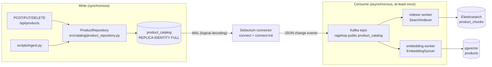
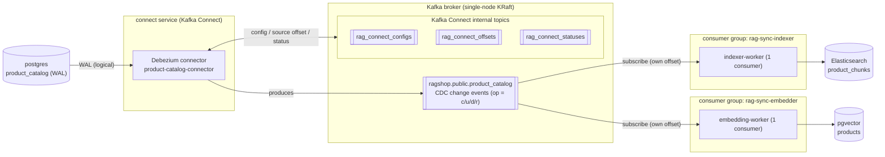
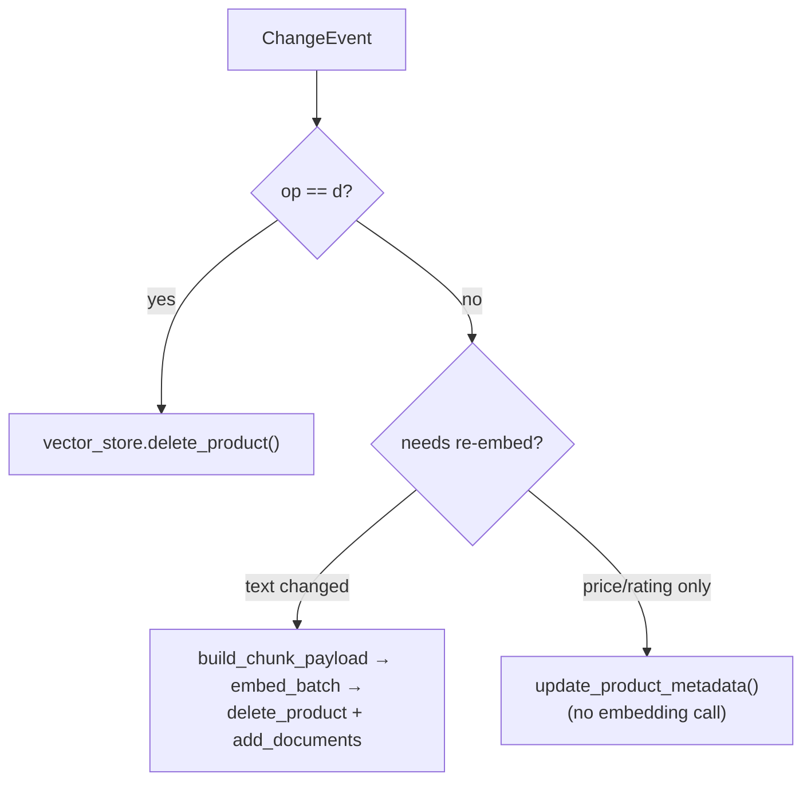
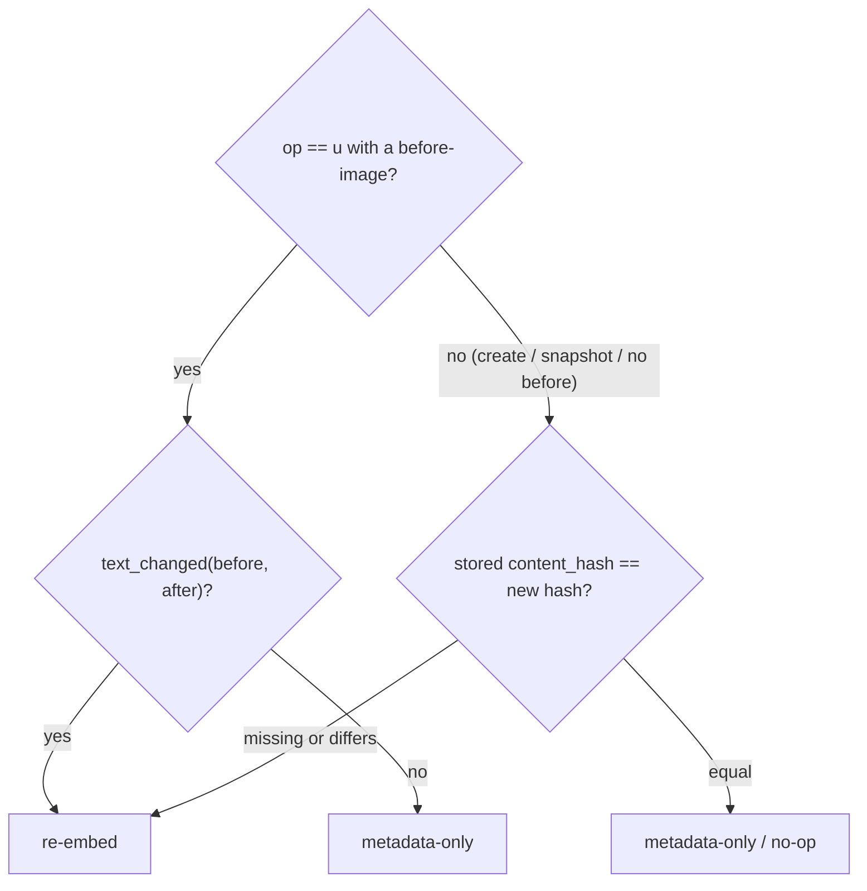

# CDC Sync (Change Data Capture)

## Overview

Deep-dive into the CDC subsystem — how Debezium, Kafka, and the two sync workers keep the Elasticsearch and pgvector search indexes in sync with the `product_catalog` source of truth.

This page is the implementation deep-dive for the **CDC** subsystem — the part
that keeps the two derived search indexes (Elasticsearch keyword + pgvector
semantic) in sync with the `product_catalog` source of truth. For the data
shapes see [Data Flow](data-flow.md); for the write entry points see
[Write Path](write-path.md); for the CLI see [sync_worker.py](../scripts/sync-worker.md).

## The problem it solves: no dual writes

If the API wrote a product to Postgres **and** Elasticsearch **and** pgvector
itself, a crash between those calls would leave the stores inconsistent (a
"dual-write" / distributed-write problem) with no easy way to tell which index
is stale.

CDC removes that class of bug. Every write lands in **one** place —
`product_catalog` — and the search indexes are rebuilt *from* it asynchronously:

- **One writer, one source of truth.** `POST/PUT/DELETE /api/products` and `scripts/ingest.py` touch only `product_catalog`.
- **Indexes are derived, never authoritative.** They can always be rebuilt by replaying the change stream.
- **Eventual consistency instead of drift.** After a write the indexes catch up a moment later; they are never *wrong*, only briefly *stale*.

## End-to-end flow



The **write** half is synchronous and returns as soon as the catalog row is
committed. The **consume** half runs continuously in two independent worker
processes.

## Kafka topology: brokers, topics, groups & the connector

Zooming into the Kafka layer, this is how the broker, its topics, the Debezium
connector and the two consumer groups relate:



- **Broker** — one single-node Kafka in **KRaft** mode (no ZooKeeper) hosts every topic; each is single-partition in the dev stack.
- **Data topic** — `ragshop.public.product_catalog`, named `{topic.prefix}.{schema}.{table}` (`ragshop` + `public.product_catalog`). Debezium **produces** one message here per catalog row change.
- **Kafka Connect internal topics** — `rag_connect_configs`, `rag_connect_offsets`, `rag_connect_statuses`. Kafka Connect creates these from the `CONFIG_STORAGE_TOPIC` / `OFFSET_STORAGE_TOPIC` / `STATUS_STORAGE_TOPIC` settings and stores the connector's **config**, its **source offset** (how far Debezium has read the Postgres WAL) and each task's **status** — so a `connect` restart resumes exactly where it left off.
- **Connector** — the Debezium Postgres connector is a **source** connector inside the `connect` service: it reads the WAL, **produces** to the data topic, and **reads/writes** the internal topics for its own state.
- **Consumer groups** — `rag-sync-indexer` and `rag-sync-embedder` each subscribe to the data topic as a **separate** group, so Kafka **fans out** every event to both; each group commits its **own** offset and can lag independently. Each group has exactly **one** consumer (one worker container) owning the single partition.

!!! note "Two different kinds of 'offset'"
    `rag_connect_offsets` stores the **connector's source offset** — Debezium's position in the Postgres WAL. The **consumer-group offsets** for `rag-sync-*` are separate; Kafka keeps those in its own internal `__consumer_offsets` topic. Consumer **lag** (see [Docker](../deployment/docker.md#kafka-topics-consumer-lag)) is measured against the latter.

## Components & files

Everything CDC-related lives in `src/sync/`, driven by one entry-point script.

| Piece | File | Responsibility |
| ----- | ---- | -------------- |
| Source of truth | `src/catalog/product_repository.py` | CRUD on `product_catalog`; sets `REPLICA IDENTITY FULL` so updates/deletes emit a full before-image |
| Connector config | `docker/debezium/product-catalog-connector.json` | Debezium Postgres connector: `topic.prefix=ragshop`, `table.include.list=public.product_catalog`, `plugin.name=pgoutput`, `snapshot.mode=initial` |
| Entry point | `scripts/sync_worker.py` | `--role indexer` or `--role embedder`; builds the handler + Kafka consumer and runs the loop |
| Consumer loop | `src/sync/runner.py` | `build_consumer()` + `run_loop()` — poll → parse → apply → commit (at-least-once) |
| Event parsing | `src/sync/events.py` | `parse_debezium_message()` → `ChangeEvent`; `content_hash()`, `text_changed()`, `metadata_fields()` |
| Chunk builder | `src/sync/chunk_builder.py` | `build_chunk_payload()` — row → `(ids, documents, metadatas)`, shared with `ingest.py` |
| Indexer handler | `src/sync/indexer_worker.py` | `SearchIndexer` → Elasticsearch (`ESKeywordSearch`) |
| Embedding handler | `src/sync/embedding_worker.py` | `EmbeddingSyncer` → pgvector (`ProductEmbedder` + `VectorStore`) |
| ES backend | `src/retrieval/es_keyword_search.py` | `upsert_chunks()` / `delete_product()` on the `product_chunks` index |
| Vector store | `src/embedding/vector_store.py` | `add_documents()` / `delete_product()` / `update_product_metadata()` / `get_product_content_hash()` |

## The Debezium change event

Debezium (JSON converter, no schemas) emits one message per row change:

```json
{
  "payload": {
    "op": "c",
    "before": null,
    "after": { "product_id": "...", "name": "...", "price": 12990000, "specifications": "{...}" }
  }
}
```

`op` values: **`c`** insert, **`u`** update, **`d`** delete, **`r`** snapshot
read (the initial snapshot / a connector restart). `parse_debezium_message()`
in `src/sync/events.py` turns this into a `ChangeEvent(op, before, after)` and:

- returns `None` for tombstones (null value), heartbeats and anything unparseable — the loop skips those and commits;
- decodes JSONB columns (`specifications`, `pros`, `cons`, `tags`), which arrive as JSON **strings** (`io.debezium.data.Json`), back into Python objects;
- derives `product_id` from `after` (or `before` for deletes).

Because the catalog table uses `REPLICA IDENTITY FULL`, an update event carries
the **complete** old row in `before`, not just the primary key — which is what
lets the embedding worker compare text fields cheaply (below).

## The consumer loop (`runner.py`)

Both workers share one loop. `build_consumer()` creates a `confluent-kafka`
consumer with:

- **`group.id`** = `rag-sync-indexer` or `rag-sync-embedder` — each worker is its own consumer group, so both receive every event independently.
- **`auto.offset.reset=earliest`** — on first start a worker reads the *whole* topic. That is how a fresh index is bootstrapped from Debezium's initial snapshot.
- **`enable.auto.commit=false`** — offsets are committed **manually, only after** the handler applied the event.

```python
event = parse_debezium_message(message.value())
if event is not None:
    handler.handle(event)   # may raise -> offset NOT committed -> redelivered
    applied += 1
consumer.commit(message)
```

This gives **at-least-once** delivery: if a handler raises, the worker crashes
without committing, and the event is redelivered on restart. Both handlers are
**idempotent**, so a redelivery re-applies to the same state harmlessly.

## Indexer worker → Elasticsearch

`SearchIndexer.handle()` (`src/sync/indexer_worker.py`):

- **`op == d`** → `es.delete_product(product_id)` (delete every chunk of that product).
- **`c` / `u` / `r`** → `build_chunk_payload()` then `es.delete_product()` **then** `es.upsert_chunks()`.

Deleting before upserting means chunk types that disappeared (e.g. specs were
removed) don't linger. Chunk ids are deterministic (`{product_id}_{chunk_type}`),
so upserts overwrite in place — replaying the stream converges to the same index.

## Embedding worker → pgvector

`EmbeddingSyncer.handle()` (`src/sync/embedding_worker.py`) is where the cost
optimisation lives — an embedding API call is the expensive step, so it runs
**only when necessary**:



### The re-embed decision (`content_hash`)

`_needs_reembed()` decides which path to take:



Two field groups drive this (`src/sync/events.py`):

- **`TEXT_FIELDS`** = `name, brand, category, description, specifications, pros, cons, review_summary`. These appear in the chunk text, so changing any of them requires re-embedding. `content_hash()` is an MD5 over exactly these fields.
- **`METADATA_FIELDS`** = `price, avg_rating, review_count`. A change to only these is propagated by `update_product_metadata()` — a cheap JSONB update with **no** embedding call.

`avg_rating` / `review_count` technically appear in the review chunk text, but
they drift constantly; re-embedding on every rating tick would burn embedding
quota for negligible relevance gain, so they are treated as metadata-only on
purpose.

The `content_hash` is stored in each chunk's metadata (and written by
`ingest.py` too). So when Debezium replays the **initial snapshot** of an
already-ingested catalog, the worker sees the stored hash still matches and
makes **zero** embedding calls — replaying the whole topic is free when nothing
changed.

## Delivery & consistency guarantees

- **At-least-once** — offsets commit after apply; a crash re-delivers, never drops.
- **Idempotent appliers** — deterministic chunk ids + upsert/delete semantics, so redelivery converges.
- **Ordering** — a single topic (single partition on the dev single-node Kafka) preserves the order of changes per product, so an update never overtakes the create before it.
- **Eventual consistency** — the only visible effect of lag is briefly stale search results; the source of truth (`product_catalog`, read directly by `GET /api/products`) is always current.

## Snapshot & bootstrapping a fresh index

`snapshot.mode: initial` means that when the connector is first registered,
Debezium reads the entire `product_catalog` table and emits it as `op=r`
("read") events before switching to live streaming. Combined with
`auto.offset.reset=earliest`, a brand-new worker (or a rebuilt, empty index)
fills itself from that snapshot with no extra tooling. `ingest.py --catalog-only`
relies on exactly this: write only the catalog, and let the workers build both
indexes from the snapshot.

## Running & operating

```bash
# In Docker these run as the indexer-worker / embedding-worker services.
# Standalone (needs Kafka + ES/Postgres reachable + connector registered):
uv run python scripts/sync_worker.py --role indexer    # -> Elasticsearch
uv run python scripts/sync_worker.py --role embedder   # -> pgvector
```

Monitoring: check consumer-group **lag** and the Debezium **connector status**
— see [Docker › Kafka & Debezium](../deployment/docker.md#kafka-topics-consumer-lag).

## Failure modes & recovery

| Failure | What happens | Recovery |
| ------- | ------------ | -------- |
| Worker crashes mid-event | Offset not committed | Event redelivered on restart (at-least-once) |
| Embedding API down / quota | `embed_batch` raises → worker exits | Restart re-consumes the same offset once the API recovers |
| Elasticsearch / pgvector down | Handler raises → not committed | Redelivered when the store is back |
| Index accidentally wiped | — | Restart the worker (or re-register the connector) → rebuilds from the snapshot |
| Connector removed / not registered | No events produced | `docker compose up -d connect-init` re-`PUT`s the config (idempotent) |

## Related

- [Write Path](write-path.md) — the synchronous half (CRUD + ingest).
- [sync_worker.py](../scripts/sync-worker.md) — execution-flow reference for the entry point.
- [Data Flow](data-flow.md#continuous-product-write-data-flow-cdc) — the same pipeline from a data-shape view.
- [Hybrid Retrieval](hybrid-retrieval.md) — how the fresh indexes are used at query time.
