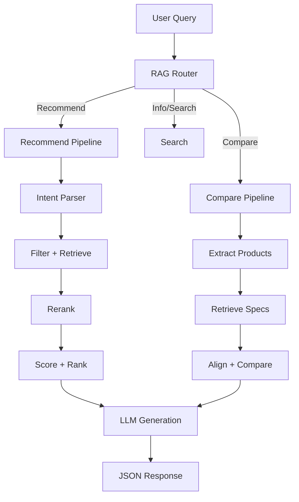

# Architecture Overview

The system follows a standard RAG architecture with four core layers:

## High-Level Flow

## Core Layers

### 1. Ingestion (`src/ingestion/`)

Loads raw product data (JSON, CSV), cleans and normalizes it, then splits each product into field-based chunks (description, specs, pros/cons, reviews). Each chunk carries metadata (product_id, brand, category, price) for filtering.

### 2. Embedding (`src/embedding/`)

Converts text chunks into vector embeddings using OpenAI's `text-embedding-3-small` model. Stores vectors in ChromaDB with cosine similarity indexing. Supports multi-field embedding for richer retrieval.

### 3. Retrieval (`src/retrieval/`)

Given a user query, the retrieval layer extracts filters from natural language (price range, brand, category), performs hybrid search (semantic + metadata), computes composite scores (semantic similarity, price match, rating, popularity), and optionally reranks with a cross-encoder.

### 4. Generation (`src/generation/`)

Takes the retrieved products and user intent, fills a prompt template, and calls the LLM (Claude or GPT) to generate a structured JSON response. Includes guardrails for input validation and output safety checks.

## Orchestration (`src/pipeline/`)

The pipeline layer ties everything together. The `RAGRouter` classifies incoming queries (recommend, compare, info, hybrid) and delegates to the appropriate pipeline. Each pipeline orchestrates the full flow from query to response.
