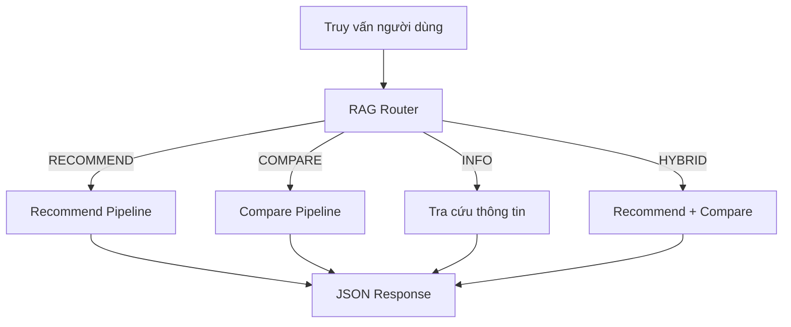
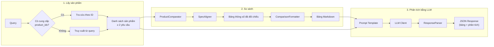
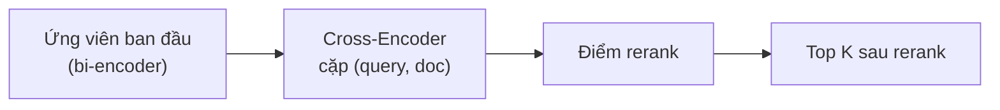
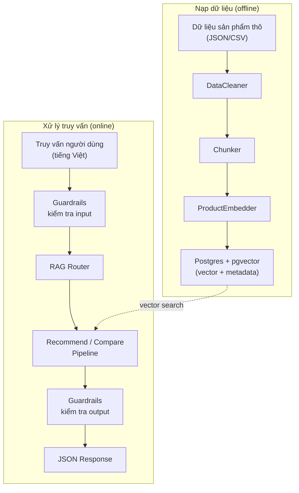

# Luồng xử lý (Pipeline Flow)

Trang này mô tả chi tiết luồng dữ liệu qua hệ thống RAG, từ truy vấn người dùng đến phản hồi cuối cùng.

## Tổng quan

Mọi truy vấn của người dùng đều đi qua **RAG Router** trước tiên, router này phân loại truy vấn thành một trong bốn loại và điều hướng tới pipeline phù hợp.



## Phân loại truy vấn (RAG Router)

`RAGRouter` phân loại truy vấn bằng cách so khớp regex trên từ khóa tiếng Việt và tiếng Anh.

| Loại truy vấn | Từ khóa kích hoạt | Ví dụ |
| ---------- | --------------- | ------- |
| **RECOMMEND** | gợi ý, nên mua, tư vấn, recommend, đề xuất | *"Tư vấn điện thoại dưới 10 triệu"* |
| **COMPARE** | so sánh, compare, vs, tốt hơn, khác nhau | *"So sánh iPhone 15 và Samsung S24"* |
| **INFO** | thông số, giá, specs, cấu hình, review | *"Giá iPhone 15 Pro Max bao nhiêu?"* |
| **HYBRID** | Khớp cả pattern recommend + compare | *"Nên mua iPhone hay Samsung, so sánh giúp tôi"* |

Nếu không pattern nào khớp, router mặc định chọn **RECOMMEND**.

**Nguồn:** `src/pipeline/rag_router.py`

---

## Recommend Pipeline

Pipeline gợi ý tìm các sản phẩm khớp với ý định của người dùng và sinh giải thích bằng LLM.

```mermaid
flowchart LR
    subgraph Intent["1. Phân tích ý định"]
        Q[Query] --> IP[UserIntentParser]
        IP --> Intent_Out["budget, use_case,\npriorities, brand_pref"]
    end

    subgraph Retrieve["2. Truy xuất"]
        Intent_Out --> FE[FilterEngine]
        FE --> Filters["price, brand,\ncategory, rating"]
        Q --> EMB[ProductEmbedder]
        EMB --> Vec[Query Vector]
        Filters --> VS[VectorStore.query]
        Vec --> VS
        VS --> Candidates["top_k × 3 candidates"]
    end

    subgraph Score["3. Chấm điểm & Xếp hạng"]
        Candidates --> SS[SimilarityScorer]
        SS --> PS[ProductScorer]
        PS --> Ranked["Đã chấm điểm + sắp xếp"]
        Ranked --> TopK["Top K sản phẩm"]
    end

    subgraph Generate["4. Sinh phản hồi"]
        TopK --> PT[Prompt Template]
        PT --> LLM[LLM Client]
        LLM --> RP[ResponseParser]
        RP --> Resp[JSON Response]
    end
```



### Từng bước

**Bước 1 — Phân tích ý định người dùng**

`UserIntentParser` phân tích truy vấn để trích xuất ý định có cấu trúc:

- **budget** — khoảng giá (vd: "dưới 15 triệu" → `price_max: 15_000_000`)
- **use_case** — mục đích sử dụng (chơi game, chụp ảnh, công việc, ...)
- **priorities** — điều quan trọng nhất (camera, pin, hiệu năng, ...)
- **brand_pref** — thương hiệu ưu tiên nếu được đề cập

**Nguồn:** `src/pipeline/recommend/user_intent_parser.py`

**Bước 2 — Filter & Retrieve**

Hai việc diễn ra song song:

1. **FilterEngine** trích xuất metadata filter từ truy vấn (thương hiệu, danh mục, khoảng giá, rating tối thiểu) bằng regex pattern trên văn bản tiếng Việt.
2. **ProductEmbedder** chuyển truy vấn thành vector bằng model `text-embedding-3-small` của OpenAI.

`ProductRetriever` sau đó truy vấn Postgres (pgvector) với cả vector lẫn metadata filter, lấy về `top_k × 3` ứng viên (lấy dư để bước chấm điểm thu hẹp lại).

**Nguồn:** `src/retrieval/product_retriever.py`, `src/retrieval/filter_engine.py`

**Bước 3 — Chấm điểm & Xếp hạng**

Mỗi ứng viên nhận một composite score từ `ProductScorer`:

- **Độ tương đồng ngữ nghĩa** — khoảng cách cosine từ vector search (chuyển đổi thành `1 - distance`)
- **Độ khớp giá** — sản phẩm phù hợp với ngân sách đến mức nào
- **Rating** — điểm đánh giá trung bình của người dùng
- **Độ khớp tính năng** — mức độ trùng khớp giữa ưu tiên người dùng và tính năng sản phẩm

Sản phẩm được sắp xếp giảm dần theo `final_score` và cắt còn `top_k`.

**Nguồn:** `src/pipeline/recommend/scoring.py`, `src/retrieval/similarity_scorer.py`

**Bước 4 — Sinh phản hồi bằng LLM**

Các sản phẩm hàng đầu được định dạng thành chuỗi ngữ cảnh (context) và chèn vào prompt template cùng ý định đã phân tích. LLM sinh phản hồi bằng tiếng Việt giải thích lý do từng sản phẩm phù hợp với nhu cầu người dùng. `ResponseParser` trích xuất JSON có cấu trúc từ output của LLM.

**Nguồn:** `src/pipeline/recommend_pipeline.py`, `src/generation/prompt_templates/recommend_prompt.py`

---

## Compare Pipeline

Pipeline so sánh truy xuất thông số của nhiều sản phẩm và sinh phân tích chi tiết.



### Từng bước

**Bước 1 — Lấy sản phẩm**

Hai đường dẫn tùy theo lời gọi API:

- **Có `product_ids`** — tra cứu trực tiếp sản phẩm từ database.
- **Không có `product_ids`** — dùng `ProductRetriever` để tìm sản phẩm được nhắc đến trong truy vấn, sau đó lấy top 3.

Cần tối thiểu 2 sản phẩm; nếu không pipeline sẽ trả về lỗi.

**Bước 2 — So sánh thông số kỹ thuật**

`ProductComparator` điều phối việc so sánh:

1. `SpecAligner` chuẩn hóa và đối chiếu thông số giữa các sản phẩm để chúng dùng chung một bộ khóa (vd: "RAM", "Bộ nhớ", "Pin").
2. `ComparisonFormatter` render dữ liệu đã đối chiếu thành bảng Markdown.
3. `ProsConsExtractor` xác định ưu điểm và nhược điểm của từng sản phẩm.

**Nguồn:** `src/pipeline/compare/comparator.py`, `src/pipeline/compare/spec_aligner.py`

**Bước 3 — Phân tích bằng LLM**

Bảng so sánh và mô tả sản phẩm được chèn vào prompt template. LLM tạo ra phân tích chi tiết bằng tiếng Việt bao gồm điểm mạnh, điểm yếu, và khuyến nghị cuối cùng dựa trên mục đích sử dụng. Phản hồi bao gồm cả bảng có cấu trúc lẫn phần phân tích tường thuật.

**Nguồn:** `src/pipeline/compare_pipeline.py`, `src/generation/prompt_templates/compare_prompt.py`

---

## Các thành phần dùng chung (Cross-Cutting)

### Hybrid Search

`HybridSearch` kết hợp nhiều chiến lược truy xuất:

- **Semantic search** — độ tương đồng vector qua Postgres + pgvector (hiện đang hoạt động)
- **Keyword search** — BM25 cho khớp từ khóa chính xác (dự kiến triển khai)
- **Metadata filter** — ràng buộc giá, thương hiệu, danh mục

Kết quả từ tất cả chiến lược được gộp lại và loại trùng.

**Nguồn:** `src/retrieval/hybrid_search.py`

### Cross-Encoder Reranking

Sau khi truy xuất ban đầu, `CrossEncoderReranker` có thể chấm điểm lại các ứng viên bằng mô hình cross-encoder (`ms-marco-MiniLM-L-6-v2`). Khác với bi-encoder mã hóa truy vấn và tài liệu riêng biệt, cross-encoder xử lý cặp (query, document) cùng lúc, cho ra điểm liên quan chính xác hơn nhưng đánh đổi bằng tốc độ.



**Nguồn:** `src/retrieval/reranker.py`

### Guardrails

Module `Guardrails` validate cả input lẫn output:

- **Validate input** — kiểm tra độ dài truy vấn, phát hiện các nỗ lực prompt injection
- **Validate output** — đảm bảo phản hồi LLM là JSON hợp lệ và không chứa dữ liệu sản phẩm bịa đặt (hallucination)

**Nguồn:** `src/generation/guardrails.py`

### LLM Client

`LLMClient` cung cấp giao diện thống nhất cho ba provider:

| Provider | Model ví dụ | SDK |
| -------- | ------------- | --- |
| Anthropic | `claude-sonnet-4-6` | `anthropic` |
| OpenAI | `gpt-4o` | `openai` |
| Gemini | `gemini-2.0-flash` | `google-genai` |

Provider được cấu hình trong `configs/settings.yaml` và API key tương ứng được tự động resolve qua mapping `PROVIDER_API_KEY_ENV`.

**Nguồn:** `src/generation/llm_client.py`

### Dependency Injection

Tất cả các component được kết nối với nhau qua các factory function trong `api/deps.py`:

```
get_config() → PipelineConfig
get_embedder() → ProductEmbedder
get_vector_store() → VectorStore
get_retriever() → ProductRetriever
get_llm_client() → LLMClient
get_recommend_pipeline() → RecommendPipeline
get_compare_pipeline() → ComparePipeline
```

Các route FastAPI gọi các factory này để lấy instance pipeline đã được cấu hình đầy đủ.

**Nguồn:** `api/deps.py`

---

## Tóm tắt luồng dữ liệu



Hệ thống có hai giai đoạn: **ingestion** (offline, theo batch) nạp dữ liệu sản phẩm vào vector store, và **runtime** (online, theo từng request) xử lý truy vấn người dùng qua pipeline phù hợp.
