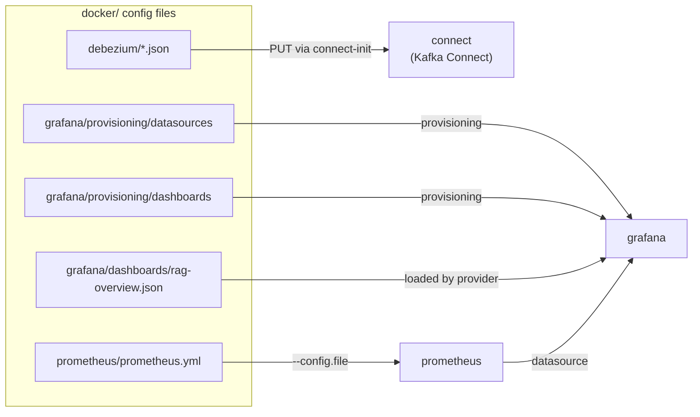

# Config Files Reference (`docker/`)

Besides `docker-compose.yml`, the `docker/` folder holds the config files that
are **mounted into** the infrastructure containers. Compose only wires services
together; the behaviour of Debezium, Prometheus and Grafana is defined by these
files. This page explains each one field by field.

```
docker/
├── Dockerfile                                  # app image build (see Docker page)
├── docker-compose.yml                          # umbrella: `include`s the files below
├── compose.core.yml                            # app + postgres + redis
├── compose.search.yml                          # elasticsearch + kibana
├── compose.cdc.yml                             # kafka + debezium + kafka-ui + workers
├── compose.monitoring.yml                      # prometheus + grafana + exporters
├── debezium/
│   └── product-catalog-connector.json          # Debezium Postgres connector config
├── prometheus/
│   └── prometheus.yml                           # Prometheus scrape targets
└── grafana/
    ├── provisioning/
    │   ├── datasources/prometheus.yml           # auto-wire the Prometheus datasource
    │   └── dashboards/dashboards.yml            # auto-load dashboards from a folder
    └── dashboards/
        └── rag-overview.json                    # the "RAG - Overview" dashboard
```

Each file is mounted read-only (`:ro`) so the container reads it but can't change
it — the file in the repo stays the single source of truth.

The `compose.*.yml` files are the per-concern service definitions pulled together
by `docker-compose.yml` via `include`; see
[Compose file organization](docker.md#compose-file-organization). This page
focuses on the **config files** those services mount.

---

## Debezium — `debezium/product-catalog-connector.json`

This JSON is the **connector configuration** that turns Postgres row changes into
Kafka events. It is not read at container start; instead the one-shot
`connect-init` service `PUT`s it to the Kafka Connect REST API
(`PUT /connectors/product-catalog-connector/config`), which is **idempotent** —
re-applying it on every `docker compose up` is safe.

```json
{
  "connector.class": "io.debezium.connector.postgresql.PostgresConnector",
  "database.hostname": "postgres",
  "database.port": "5432",
  "database.user": "postgres",
  "database.password": "postgres",
  "database.dbname": "rag_products",
  "topic.prefix": "ragshop",
  "table.include.list": "public.product_catalog",
  "plugin.name": "pgoutput",
  "publication.autocreate.mode": "filtered",
  "snapshot.mode": "initial",
  "tombstones.on.delete": "false",
  "key.converter": "org.apache.kafka.connect.json.JsonConverter",
  "value.converter": "org.apache.kafka.connect.json.JsonConverter",
  "key.converter.schemas.enable": "false",
  "value.converter.schemas.enable": "false"
}
```

| Field | Value | Meaning |
| ----- | ----- | ------- |
| `connector.class` | `io.debezium.connector.postgresql.PostgresConnector` | Use Debezium's Postgres connector (one class per source DB type). |
| `database.hostname` / `database.port` | `postgres` / `5432` | Where to connect — the Compose service name `postgres` resolves on the Docker network. |
| `database.user` / `database.password` | `postgres` / `postgres` | Login used to read the WAL. In production this should be a dedicated replication user from a secret, not inline. |
| `database.dbname` | `rag_products` | The database to capture from. |
| `topic.prefix` | `ragshop` | Namespaces the Kafka topics. Combined with the table, changes to `public.product_catalog` land on topic **`ragshop.public.product_catalog`**. |
| `table.include.list` | `public.product_catalog` | **Only** this table is captured. The `products`/pgvector table is a CDC *sink*, not a source — excluding it prevents a feedback loop. |
| `plugin.name` | `pgoutput` | The Postgres logical-decoding output plugin. `pgoutput` is built into Postgres 10+, so no extra extension is needed (works with the `pgvector/pgvector:pg16` image). |
| `publication.autocreate.mode` | `filtered` | Debezium creates a Postgres *publication* covering only the included tables (not `FOR ALL TABLES`), matching `table.include.list`. |
| `snapshot.mode` | `initial` | On first run, snapshot the **existing** rows once, then stream live changes. This is how a fresh index gets bootstrapped from data already in the catalog. |
| `tombstones.on.delete` | `false` | On a delete, emit a single delete event and **no** extra null "tombstone" record. The sync workers handle the delete event directly. |
| `key.converter` / `value.converter` | `JsonConverter` | Serialize Kafka message keys/values as JSON (readable in Kafka UI; consumed by the Python workers). |
| `key.converter.schemas.enable` / `value.converter.schemas.enable` | `false` | Emit **plain** JSON without the verbose Connect schema envelope, so a message payload is just the row fields. |

For CDC prerequisites, Postgres must run with `wal_level=logical` (set via the
`postgres` service `command` in `docker-compose.yml`). See
[CDC Sync](../architecture/cdc.md) and [sync_worker.py](../scripts/sync-worker.md)
for how the emitted events are consumed.

!!! note "Changing the connector"
    Editing this file and re-running `docker compose up -d connect-init` (or
    `docker compose restart connect-init`) re-applies the config. Some fields
    (like `snapshot.mode`) only take effect on a fresh slot — a `docker compose
    down -v` clears the Kafka log and Debezium offsets for a clean re-snapshot.

---

## Prometheus — `prometheus/prometheus.yml`

Prometheus is **pull-based**: this file lists the HTTP endpoints it scrapes and
how often. It's mounted at `/etc/prometheus/prometheus.yml` and selected by the
service `command` (`--config.file=/etc/prometheus/prometheus.yml`).

```yaml
global:
  scrape_interval: 15s
  evaluation_interval: 15s
  external_labels:
    stack: techscout-rag-recommend

scrape_configs:
  - job_name: prometheus
    static_configs:
      - targets: ["localhost:9090"]
  - job_name: rag-api
    metrics_path: /metrics
    static_configs:
      - targets: ["app:8000"]
  # ... postgres / redis / elasticsearch / kafka exporters
```

| Key | Meaning |
| --- | ------- |
| `global.scrape_interval` | How often every target is scraped (15s). Each scrape stores one sample per series. |
| `global.evaluation_interval` | How often alerting/recording rules are evaluated (none defined yet, but the cadence is set). |
| `global.external_labels` | Labels attached to **all** series leaving this Prometheus (`stack="techscout-rag-recommend"`). Useful when federating or comparing multiple stacks. |
| `scrape_configs[].job_name` | Logical name for a group of targets; becomes the `job` label on every metric (`job="rag-api"`, …). |
| `scrape_configs[].metrics_path` | Path to scrape. Defaults to `/metrics`; set explicitly for `rag-api` for clarity. |
| `scrape_configs[].static_configs[].targets` | `host:port` list. Hosts are **Compose service names** (`app`, `postgres-exporter`, …) resolved on the Docker network. |

The jobs and what they scrape:

| Job | Target | Provides |
| --- | ------ | -------- |
| `prometheus` | `localhost:9090` | Prometheus scraping itself (liveness). |
| `rag-api` | `app:8000/metrics` | HTTP request/latency/status + the `rag_*` pipeline metrics. |
| `postgres` | `postgres-exporter:9187` | Postgres internals. |
| `redis` | `redis-exporter:9121` | Redis stats. |
| `elasticsearch` | `elasticsearch-exporter:9114` | ES cluster/index metrics. |
| `kafka` | `kafka-exporter:9308` | Consumer-group lag + offsets. |

After a change, restart Prometheus (`docker compose restart prometheus`) and
verify at **Status → Targets** (`http://localhost:9090/targets`) that every job is
**UP**. See [Monitoring](monitoring.md) for the metrics reference.

---

## Grafana — `grafana/`

Grafana is configured entirely through **provisioning** — files it reads on
startup so there's nothing to click through. The `grafana` service mounts
`grafana/provisioning/` at `/etc/grafana/provisioning` and `grafana/dashboards/`
at `/var/lib/grafana/dashboards`.

### `provisioning/datasources/prometheus.yml`

Auto-connects Grafana to Prometheus so queries work immediately.

```yaml
apiVersion: 1
datasources:
  - name: Prometheus
    type: prometheus
    uid: rag-prometheus
    access: proxy
    url: http://prometheus:9090
    isDefault: true
    editable: true
```

| Field | Meaning |
| ----- | ------- |
| `apiVersion` | Provisioning schema version (`1`). |
| `name` | Display name shown in the datasource picker. |
| `type` | Datasource plugin — `prometheus`. |
| `uid` | **Stable** id (`rag-prometheus`). The dashboard JSON references this exact uid, so pinning it keeps the link intact across restarts. |
| `access` | `proxy` = the Grafana **server** calls Prometheus (browser never talks to it directly), which works inside the Docker network. |
| `url` | `http://prometheus:9090` — the Compose service name. |
| `isDefault` | New panels default to this datasource. |
| `editable` | Allow tweaking in the UI (changes are not written back to this file). |

### `provisioning/dashboards/dashboards.yml`

Tells Grafana to load **every** dashboard JSON found under a folder.

```yaml
apiVersion: 1
providers:
  - name: RAG dashboards
    orgId: 1
    folder: ""
    type: file
    disableDeletion: false
    updateIntervalSeconds: 30
    allowUiUpdates: true
    options:
      path: /var/lib/grafana/dashboards
```

| Field | Meaning |
| ----- | ------- |
| `providers[].name` | Label for this provider (internal). |
| `orgId` | Grafana organization to load into (`1` = default). |
| `folder` | Dashboard folder in the UI; `""` = the General/root folder. |
| `type` | `file` — read dashboards from disk. |
| `disableDeletion` | If `true`, blocks deleting provisioned dashboards from the UI. |
| `updateIntervalSeconds` | How often Grafana re-scans the folder (30s) — drop in a new JSON and it appears without a restart. |
| `allowUiUpdates` | Allow saving UI edits to provisioned dashboards. |
| `options.path` | The mounted folder to scan (`/var/lib/grafana/dashboards`). |

### `dashboards/rag-overview.json`

The **RAG - Overview** dashboard, loaded by the provider above. It's a standard
Grafana dashboard model; the fields that matter for maintenance:

| Field | Meaning |
| ----- | ------- |
| `uid` | Stable dashboard id (`rag-overview`) — used in its URL and by `GF_DASHBOARDS_DEFAULT_HOME_DASHBOARD_PATH` to make it the home page. |
| `title` | `RAG - Overview`. |
| `tags` | `["rag", "overview"]` for filtering in the dashboard list. |
| `time` | Default range (`now-1h` → `now`). |
| `refresh` | Auto-refresh interval (`30s`). |
| `panels[]` | The tiles. Each has a `type` (`timeseries`/`stat`), `gridPos` (layout), a `targets[]` list of PromQL `expr`s, and a `datasource` of `{"type":"prometheus","uid":"rag-prometheus"}` — matching the datasource uid above. |

Every panel's `datasource.uid` is `rag-prometheus`, which is why the datasource
file pins that uid. To add a panel, edit in the Grafana UI and *Save*, or add
another `*.json` here — the provider picks it up within 30 seconds.

The `grafana` service also sets a few `GF_*` environment variables in
`docker-compose.yml` (admin user/password, disable sign-up, and
`GF_DASHBOARDS_DEFAULT_HOME_DASHBOARD_PATH` pointing at this dashboard so it's the
landing page).

---

## How they fit together



## Related

- [Docker Deployment](docker.md) — the services that mount these files, ports and volumes.
- [Monitoring](monitoring.md) — the Prometheus/Grafana metrics and dashboard queries.
- [CDC Sync](../architecture/cdc.md) — how the Debezium events flow to the search indexes.
- [sync_worker.py](../scripts/sync-worker.md) — the workers that consume the CDC topic.
