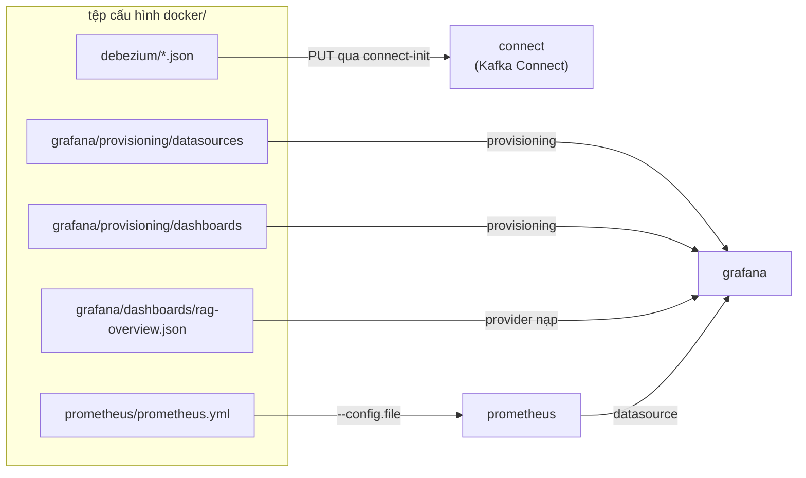

# Tham chiếu tệp cấu hình (`docker/`)

## Tổng quan

Giải thích chi tiết từng trường các tệp cấu hình trong `docker/` được mount vào các container hạ tầng — Debezium connector, cấu hình scrape của Prometheus, và provisioning cùng dashboard của Grafana.

Ngoài `docker-compose.yml`, thư mục `docker/` còn chứa các tệp cấu hình được
**mount vào** các container hạ tầng. Compose chỉ nối các service với nhau; còn
hành vi của Debezium, Prometheus và Grafana do các tệp này quy định. Trang này
giải thích từng tệp theo từng trường (field).

```
docker/
├── Dockerfile                                  # build image app (xem trang Docker)
├── docker-compose.yml                          # umbrella: `include` các file dưới đây
├── compose.core.yml                            # app + postgres + redis
├── compose.search.yml                          # elasticsearch + kibana
├── compose.cdc.yml                             # kafka + debezium + kafka-ui + worker
├── compose.monitoring.yml                      # prometheus + grafana + exporter
├── debezium/
│   └── product-catalog-connector.json          # cấu hình Debezium Postgres connector
├── prometheus/
│   └── prometheus.yml                           # scrape target của Prometheus
└── grafana/
    ├── provisioning/
    │   ├── datasources/prometheus.yml           # tự nối datasource Prometheus
    │   └── dashboards/dashboards.yml            # tự nạp dashboard từ một thư mục
    └── dashboards/
        └── rag-overview.json                    # dashboard "RAG - Overview"
```

Mỗi tệp được mount chỉ-đọc (`:ro`) nên container đọc được nhưng không sửa được —
tệp trong repo vẫn là nguồn chân lý duy nhất.

Các tệp `compose.*.yml` là định nghĩa service theo từng concern, được
`docker-compose.yml` gộp lại qua `include`; xem
[Tổ chức các file Compose](docker.md#compose-file-organization). Trang này tập
trung vào các **tệp cấu hình** mà các service đó mount.

---

## Debezium — `debezium/product-catalog-connector.json`

JSON này là **cấu hình connector** biến thay đổi hàng trong Postgres thành sự kiện
Kafka. Nó không được đọc lúc container khởi động; thay vào đó service one-shot
`connect-init` gửi `PUT` tới REST API của Kafka Connect
(`PUT /connectors/product-catalog-connector/config`) — thao tác **idempotent**,
nên áp lại ở mỗi lần `docker compose up` là an toàn.

```json
{
  "connector.class": "io.debezium.connector.postgresql.PostgresConnector",
  "database.hostname": "postgres",
  "database.port": "5432",
  "database.user": "postgres",
  "database.password": "postgres",
  "database.dbname": "rag_products",
  "topic.prefix": "ragshop",
  "table.include.list": "public.product_catalog",
  "plugin.name": "pgoutput",
  "publication.autocreate.mode": "filtered",
  "snapshot.mode": "initial",
  "tombstones.on.delete": "false",
  "key.converter": "org.apache.kafka.connect.json.JsonConverter",
  "value.converter": "org.apache.kafka.connect.json.JsonConverter",
  "key.converter.schemas.enable": "false",
  "value.converter.schemas.enable": "false"
}
```

| Trường | Giá trị | Ý nghĩa |
| ------ | ------- | ------- |
| `connector.class` | `io.debezium.connector.postgresql.PostgresConnector` | Dùng connector Postgres của Debezium (mỗi loại DB nguồn một class). |
| `database.hostname` / `database.port` | `postgres` / `5432` | Nơi kết nối — tên service Compose `postgres` phân giải được trên mạng Docker. |
| `database.user` / `database.password` | `postgres` / `postgres` | Tài khoản đọc WAL. Ở production nên là user replication riêng lấy từ secret, không để inline. |
| `database.dbname` | `rag_products` | Database cần capture. |
| `topic.prefix` | `ragshop` | Namespace cho topic Kafka. Ghép với tên bảng, thay đổi ở `public.product_catalog` sẽ vào topic **`ragshop.public.product_catalog`**. |
| `table.include.list` | `public.product_catalog` | **Chỉ** capture bảng này. Bảng `products`/pgvector là *sink* của CDC chứ không phải nguồn — loại nó ra để tránh vòng lặp phản hồi. |
| `plugin.name` | `pgoutput` | Plugin logical-decoding của Postgres. `pgoutput` có sẵn từ Postgres 10+, không cần extension thêm (chạy được với image `pgvector/pgvector:pg16`). |
| `publication.autocreate.mode` | `filtered` | Debezium tạo một *publication* Postgres chỉ gồm các bảng included (không phải `FOR ALL TABLES`), khớp với `table.include.list`. |
| `snapshot.mode` | `initial` | Lần đầu, snapshot **toàn bộ** hàng đang có một lần, rồi stream thay đổi trực tiếp. Đây là cách index mới được khởi tạo từ dữ liệu đã có trong catalog. |
| `tombstones.on.delete` | `false` | Khi xóa, phát một sự kiện delete và **không** kèm bản ghi null "tombstone". Sync worker xử lý trực tiếp sự kiện delete. |
| `key.converter` / `value.converter` | `JsonConverter` | Serialize key/value của message Kafka thành JSON (đọc được trong Kafka UI; worker Python tiêu thụ). |
| `key.converter.schemas.enable` / `value.converter.schemas.enable` | `false` | Phát JSON **thuần**, bỏ lớp schema envelope dài dòng của Connect, nên payload chỉ gồm các trường của hàng. |

Điều kiện tiên quyết của CDC: Postgres phải chạy với `wal_level=logical` (đặt qua
`command` của service `postgres` trong `docker-compose.yml`). Xem
[Đồng bộ CDC](../architecture/cdc.md) và [sync_worker.py](../scripts/sync-worker.md)
để biết các sự kiện phát ra được tiêu thụ thế nào.

!!! note "Thay đổi connector"
    Sửa tệp này rồi chạy lại `docker compose up -d connect-init` (hoặc
    `docker compose restart connect-init`) để áp lại cấu hình. Một số trường (như
    `snapshot.mode`) chỉ có hiệu lực trên slot mới — `docker compose down -v` xóa
    Kafka log và Debezium offset để snapshot lại sạch sẽ.

---

## Prometheus — `prometheus/prometheus.yml`

Prometheus theo mô hình **kéo (pull)**: tệp này liệt kê các endpoint HTTP nó scrape
và tần suất. Nó được mount tại `/etc/prometheus/prometheus.yml` và chọn qua
`command` của service (`--config.file=/etc/prometheus/prometheus.yml`).

```yaml
global:
  scrape_interval: 15s
  evaluation_interval: 15s
  external_labels:
    stack: techscout-rag-recommend

scrape_configs:
  - job_name: prometheus
    static_configs:
      - targets: ["localhost:9090"]
  - job_name: rag-api
    metrics_path: /metrics
    static_configs:
      - targets: ["app:8000"]
  # ... exporter postgres / redis / elasticsearch / kafka
```

| Khóa | Ý nghĩa |
| ---- | ------- |
| `global.scrape_interval` | Tần suất scrape mọi target (15s). Mỗi lần scrape lưu một sample cho mỗi series. |
| `global.evaluation_interval` | Tần suất đánh giá rule alerting/recording (chưa định nghĩa rule nào, nhưng nhịp đã đặt sẵn). |
| `global.external_labels` | Nhãn gắn vào **mọi** series rời khỏi Prometheus này (`stack="techscout-rag-recommend"`). Hữu ích khi federate hoặc so nhiều stack. |
| `scrape_configs[].job_name` | Tên logic cho một nhóm target; trở thành nhãn `job` trên mọi metric (`job="rag-api"`, …). |
| `scrape_configs[].metrics_path` | Đường dẫn scrape. Mặc định `/metrics`; đặt rõ cho `rag-api` cho dễ đọc. |
| `scrape_configs[].static_configs[].targets` | Danh sách `host:port`. Host là **tên service Compose** (`app`, `postgres-exporter`, …) phân giải trên mạng Docker. |

Các job và thứ chúng scrape:

| Job | Target | Cung cấp |
| --- | ------ | -------- |
| `prometheus` | `localhost:9090` | Prometheus tự scrape chính nó (liveness). |
| `rag-api` | `app:8000/metrics` | HTTP request/latency/status + các metric pipeline `rag_*`. |
| `postgres` | `postgres-exporter:9187` | Nội tại Postgres. |
| `redis` | `redis-exporter:9121` | Thống kê Redis. |
| `elasticsearch` | `elasticsearch-exporter:9114` | Metric cluster/index của ES. |
| `kafka` | `kafka-exporter:9308` | Lag consumer-group + offset. |

Sau khi đổi, khởi động lại Prometheus (`docker compose restart prometheus`) và
kiểm tra ở **Status → Targets** (`http://localhost:9090/targets`) rằng mọi job đều
**UP**. Xem [Giám sát](monitoring.md) để biết danh sách metric.

---

## Grafana — `grafana/`

Grafana được cấu hình hoàn toàn qua **provisioning** — các tệp nó đọc lúc khởi động
nên không phải bấm gì. Service `grafana` mount `grafana/provisioning/` vào
`/etc/grafana/provisioning` và `grafana/dashboards/` vào `/var/lib/grafana/dashboards`.

### `provisioning/datasources/prometheus.yml`

Tự nối Grafana với Prometheus để truy vấn chạy được ngay.

```yaml
apiVersion: 1
datasources:
  - name: Prometheus
    type: prometheus
    uid: rag-prometheus
    access: proxy
    url: http://prometheus:9090
    isDefault: true
    editable: true
```

| Trường | Ý nghĩa |
| ------ | ------- |
| `apiVersion` | Phiên bản schema provisioning (`1`). |
| `name` | Tên hiển thị trong bộ chọn datasource. |
| `type` | Plugin datasource — `prometheus`. |
| `uid` | Id **cố định** (`rag-prometheus`). JSON dashboard tham chiếu đúng uid này, nên ghim nó giúp liên kết không đứt qua các lần restart. |
| `access` | `proxy` = **server** Grafana gọi Prometheus (trình duyệt không gọi trực tiếp), hợp với mạng Docker. |
| `url` | `http://prometheus:9090` — tên service Compose. |
| `isDefault` | Panel mới mặc định dùng datasource này. |
| `editable` | Cho phép chỉnh trong UI (thay đổi không ghi ngược lại tệp này). |

### `provisioning/dashboards/dashboards.yml`

Bảo Grafana nạp **mọi** JSON dashboard tìm thấy trong một thư mục.

```yaml
apiVersion: 1
providers:
  - name: RAG dashboards
    orgId: 1
    folder: ""
    type: file
    disableDeletion: false
    updateIntervalSeconds: 30
    allowUiUpdates: true
    options:
      path: /var/lib/grafana/dashboards
```

| Trường | Ý nghĩa |
| ------ | ------- |
| `providers[].name` | Nhãn cho provider (nội bộ). |
| `orgId` | Organization Grafana để nạp vào (`1` = mặc định). |
| `folder` | Thư mục dashboard trong UI; `""` = thư mục General/gốc. |
| `type` | `file` — đọc dashboard từ đĩa. |
| `disableDeletion` | Nếu `true`, chặn xóa dashboard provisioned từ UI. |
| `updateIntervalSeconds` | Tần suất Grafana quét lại thư mục (30s) — thả JSON mới vào là hiện ra, không cần restart. |
| `allowUiUpdates` | Cho phép lưu chỉnh sửa UI vào dashboard provisioned. |
| `options.path` | Thư mục được mount để quét (`/var/lib/grafana/dashboards`). |

### `dashboards/rag-overview.json`

Dashboard **RAG - Overview**, được provider ở trên nạp. Nó là model dashboard
Grafana chuẩn; các trường quan trọng khi bảo trì:

| Trường | Ý nghĩa |
| ------ | ------- |
| `uid` | Id dashboard cố định (`rag-overview`) — dùng trong URL và bởi `GF_DASHBOARDS_DEFAULT_HOME_DASHBOARD_PATH` để đặt làm trang chủ. |
| `title` | `RAG - Overview`. |
| `tags` | `["rag", "overview"]` để lọc trong danh sách dashboard. |
| `time` | Khoảng mặc định (`now-1h` → `now`). |
| `refresh` | Tần suất tự làm mới (`30s`). |
| `panels[]` | Các ô. Mỗi ô có `type` (`timeseries`/`stat`), `gridPos` (bố cục), danh sách `targets[]` gồm biểu thức PromQL `expr`, và `datasource` là `{"type":"prometheus","uid":"rag-prometheus"}` — khớp uid datasource ở trên. |

`datasource.uid` của mọi panel đều là `rag-prometheus`, đó là lý do tệp datasource
ghim uid đó. Muốn thêm panel: chỉnh trong Grafana UI rồi *Save*, hoặc thêm một tệp
`*.json` vào đây — provider nhận ra trong vòng 30 giây.

Service `grafana` cũng đặt vài biến môi trường `GF_*` trong `docker-compose.yml`
(user/mật khẩu admin, tắt đăng ký, và `GF_DASHBOARDS_DEFAULT_HOME_DASHBOARD_PATH`
trỏ tới dashboard này để làm trang chủ).

---

## Cách chúng khớp với nhau



## Liên quan

- [Triển khai Docker](docker.md) — các service mount những tệp này, cổng và volume.
- [Giám sát](monitoring.md) — metric Prometheus/Grafana và các truy vấn dashboard.
- [Đồng bộ CDC](../architecture/cdc.md) — các sự kiện Debezium chảy tới index tìm kiếm thế nào.
- [sync_worker.py](../scripts/sync-worker.md) — các worker tiêu thụ topic CDC.
