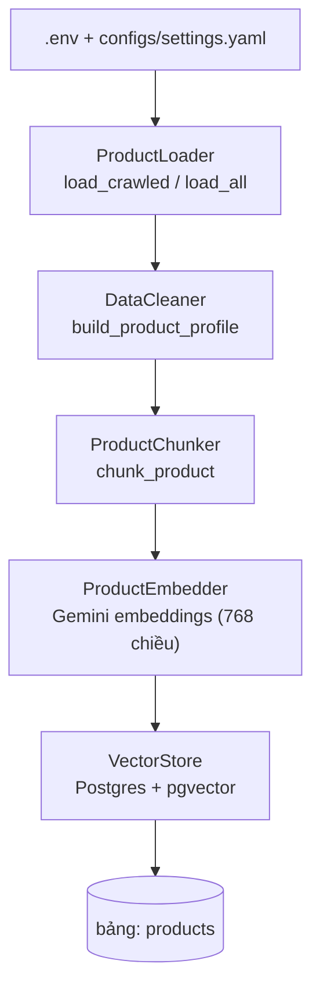

# Nạp dữ liệu (Ingestion)

Script nạp dữ liệu (`scripts/ingest.py`) biến dữ liệu sản phẩm thô thành các
vector có thể tìm kiếm. Nó đọc sản phẩm từ đĩa, chuẩn hóa, chia mỗi sản phẩm
thành các chunk theo ngữ cảnh, embedding từng chunk, rồi upsert kết quả vào kho
PostgreSQL + pgvector phục vụ truy xuất.

Đây là cầu nối giữa [Crawler](crawler.md) (tạo dữ liệu thô) và các pipeline
gợi ý/so sánh (truy vấn vector store).

## Cách chạy

```bash
uv run python scripts/ingest.py                 # source=crawled (mặc định)
uv run python scripts/ingest.py --source products
uv run python scripts/ingest.py --source all
```

| `--source`   | Đọc từ                                                  | Số lượng thường thấy |
| ------------ | ------------------------------------------------------ | -------------------- |
| `crawled`    | `data/raw/crawled/<nguồn>/latest.json` (mỗi site 1 file) | ~92 sản phẩm         |
| `products`   | `data/raw/products/*.json` và `*.csv`                  | 3 (dữ liệu mẫu)      |
| `all`        | cả hai nguồn trên                                       | ~95 sản phẩm         |

## Tổng quan luồng



## Bước 1 — Môi trường & cấu hình

`main()` gọi `load_dotenv()` trước tiên để đọc file `.env` trước mọi lần lấy API
key, sau đó nạp `PipelineConfig` từ `configs/settings.yaml`.

Các thiết lập chi phối quá trình nạp:

| Thiết lập            | Mặc định                | Dùng để                                   |
| -------------------- | ----------------------- | ----------------------------------------- |
| `embedding_provider` | `gemini`                | chọn backend embedding                    |
| `embedding_model`    | `gemini-embedding-001`  | tên model embedding                       |
| `embedding_dim`      | `768`                   | số chiều vector (cũng là cột pgvector)    |
| `vector_db_url`      | `postgresql://…/rag_products` | kết nối DB (bị `DATABASE_URL` ghi đè) |
| `collection_name`    | `products`              | tên bảng đích                             |

API key được lấy từ biến môi trường qua
`resolve_api_keys(<PROVIDER>_API_KEY)`, hỗ trợ một hoặc nhiều key để xoay vòng
token (xem Bước 5):

```properties
GEMINI_API_KEY=key_1,key_2          # ngăn cách bằng dấu phẩy, hoặc…
GEMINI_API_KEY_1=key_2              # …biến thể đánh số
```

## Bước 2 — Nạp dữ liệu thô

`ProductLoader` đọc sản phẩm tùy theo `--source`:

- **`load_crawled()`** quét `data/raw/crawled/*/latest.json` — đúng một file
  `latest.json` cho mỗi thư mục nguồn (`tgdd/`, `cellphones/`). Các snapshot theo
  timestamp trong cùng thư mục được cố ý bỏ qua để không đếm trùng sản phẩm.
- **`load_all()`** đọc mọi file `.json` / `.csv` trong `data/raw/products/`.

Mỗi sản phẩm là một `dict` thuần. Loader không kiểm tra schema — mọi field phía
sau đều được đọc phòng thủ bằng `.get()` kèm giá trị mặc định hợp lý.

## Bước 3 — Làm sạch & chuẩn hóa

`DataCleaner.build_product_profile(raw)` ánh xạ bản ghi thô sang **hồ sơ sản phẩm**
chuẩn. Đây cũng là nơi sửa các lỗi từ crawler.

| Field hồ sơ      | Nguồn                                    | Ghi chú                                             |
| ---------------- | ---------------------------------------- | -------------------------------------------------- |
| `product_id`     | `raw["id"]`                              | vd `tgdd-iphone-17-pro-max`                         |
| `name`           | `clean_text(raw["name"])`               | bỏ HTML/khoảng trắng thừa                           |
| `brand`          | `detect_brand(name)` hoặc `brand` thô   | map dòng sản phẩm về hãng (iPhone → **Apple**)      |
| `category`       | `raw["category"].lower()`               |                                                    |
| `price`          | `normalize_price(raw["price"])`         | chỉ lấy số giá đầu tiên                             |
| `currency`       | `raw["currency"]`                       | mặc định `VND`                                     |
| `specifications` | `raw["specifications"]`                 | `dict` nhãn → giá trị                               |
| `description`    | `clean_text(raw["description"])`        |                                                    |
| `pros` / `cons`  | list trong `raw`                        |                                                    |
| `avg_rating`     | `float(raw["avg_rating"])`              |                                                    |
| `review_count`   | `int(raw["review_count"])`              |                                                    |
| `review_summary` | `""`                                     | do một bước LLM riêng điền, không phải ingest       |
| `tags`           | `raw["tags"]`                           |                                                    |

!!! note "Sửa brand & giá"
    `detect_brand` đọc hãng từ **tên** sản phẩm (nên giá trị thô như `"Điện"` trở
    thành `"Apple"`/`"Samsung"`/…), còn `normalize_price` chỉ lấy số giá đầu tiên
    để tránh nối nhiều giá trên trang. Xem [Crawler](crawler.md) để biết nguồn dữ
    liệu thô.

## Bước 4 — Chia chunk

`ProductChunker.chunk_product(profile)` thực hiện **chunking theo field**: mỗi
sản phẩm được chia thành vài chunk văn bản nhỏ, độc lập, để truy xuất khớp đúng
khía cạnh liên quan nhất (thông số vs. đánh giá vs. mô tả).

| `chunk_type`     | Được tạo khi…              | Dạng văn bản                                                   |
| ---------------- | ------------------------- | ------------------------------------------------------------- |
| `description`    | luôn luôn                 | `"{name} - {brand}. {description}"`                           |
| `specifications` | có `specifications`       | `"Thông số kỹ thuật {name}:"` + mỗi thông số một dòng `- nhãn: giá trị` |
| `pros_cons`      | có `pros`/`cons`          | `"Đánh giá {name}: Ưu điểm: …; Nhược điểm: …"`                |
| `review`         | có `review_summary`       | `"Đánh giá về {name}: … Rating: x/5 (n reviews)"`             |

Mỗi chunk mang metadata nhẹ dùng để lọc về sau: `product_id`, `brand`,
`category`, `price`, kèm `chunk_type` của chính nó.

!!! info "Dữ liệu crawl → 2 chunk mỗi sản phẩm"
    Sản phẩm crawl hiện chưa có `pros`/`cons` và `review_summary`, nên mỗi sản
    phẩm sinh ra **2 chunk** (`description` + `specifications`). Vì vậy 92 sản
    phẩm crawl tạo ra ~184 chunk.

## Bước 5 — Embedding

`text` của mỗi chunk được embedding qua `ProductEmbedder`, ủy quyền cho provider
đã cấu hình (mặc định Gemini).

**Lời gọi embedding hoạt động thế nào** (`GeminiEmbeddingProvider`):

- Dùng `google-genai`: `client.models.embed_content(model, contents, config)`.
- `contents` là **danh sách văn bản** (cả một batch trong một request).
- `config = EmbedContentConfig(output_dimensionality=768)` yêu cầu vector 768
  chiều để khớp đúng cột pgvector (model `gemini-embedding-001` hỗ trợ các kích
  thước Matryoshka như 768/1536/3072).

**Batch hoạt động thế nào** (`ProductEmbedder.embed_batch`):

- Văn bản được xử lý theo lát cắt `batch_size` (mặc định **100**).
- Mỗi vector trả về là `list[float]` dài `embedding_dim` (768).

| Tham số embedding   | Giá trị                  | Nơi thiết lập                   |
| ------------------- | ------------------------ | ------------------------------- |
| Provider            | `gemini`                 | `settings.embedding_provider`   |
| Model               | `gemini-embedding-001`   | `settings.embedding_model`      |
| Số chiều đầu ra     | `768`                    | `settings.embedding_dim`        |
| Batch size          | `100`                    | `embed_batch(batch_size=…)`     |
| Độ đo tương đồng    | cosine                   | index pgvector (xem Bước 6)     |

### Giới hạn tốc độ & xoay vòng token

Free tier của Gemini cho phép ~**100 request embedding/phút**. `ProductEmbedder`
tự xử lý:

1. Khi gặp lỗi `429 / RESOURCE_EXHAUSTED`, nó **đổi sang key kế tiếp** và thử lại
   ngay lập tức.
2. Chỉ khi **tất cả** key đều hết quota mới ngủ theo thời gian API gợi ý
   (`retry in …s`) rồi thử lại — tối đa `max_retries` lần chờ.

Cấu hình nhiều key (xem Bước 1) để nhân throughput: với *N* key bạn có hiệu quả
*N × 100* embedding mỗi phút. Cơ chế này cũng được LLM client dùng lại khi sinh
nội dung.

## Bước 6 — Lưu vào vector store

`VectorStore.setup()` kết nối Postgres, bật extension `vector`, tạo bảng + index
HNSW nếu chưa có. Sau đó `add_documents()` upsert từng chunk.

Bảng `products` (chính là `collection_name`):

| Cột         | Kiểu            | Nội dung                                             |
| ----------- | --------------- | ---------------------------------------------------- |
| `id`        | `TEXT` (PK)     | `"{product_id}_{chunk_type}"`, vd `tgdd-iphone-17-pro-max_specifications` |
| `document`  | `TEXT`          | văn bản chunk (thứ được hiển thị/truy xuất)          |
| `metadata`  | `JSONB`         | `{product_id, brand, category, price, chunk_type}`   |
| `embedding` | `vector(768)`   | embedding Gemini                                     |

- **Index:** `USING hnsw (embedding vector_cosine_ops)` — tương đồng cosine.
- **Upsert:** `INSERT … ON CONFLICT (id) DO UPDATE`, nên chạy lại ingest sẽ làm
  mới các dòng cũ thay vì tạo trùng.
- **Truy vấn** (dùng khi retrieval): `embedding <=> %s::vector` sắp xếp tăng dần
  (gần nhất trước), kèm lọc tùy chọn `metadata->>key = value`.

Ví dụ một dòng đã lưu:

```json
{
  "id": "tgdd-iphone-17-pro-max_description",
  "document": "iPhone 17 Pro Max 256GB - Apple. …",
  "metadata": {
    "product_id": "tgdd-iphone-17-pro-max",
    "brand": "Apple",
    "category": "smartphone",
    "price": 37990000,
    "chunk_type": "description"
  },
  "embedding": [0.0123, -0.0456, "… 768 số thực …"]
}
```

## Chạy lại & xóa dữ liệu

Vì insert dựa trên khóa `id` (`{product_id}_{chunk_type}`), nạp lại cùng nguồn sẽ
**ghi đè** các dòng đó nhưng giữ nguyên các dòng không liên quan (vd sản phẩm mẫu
cũ). Để làm sạch từ đầu:

```bash
# nhanh nhất: dọn rỗng bảng, giữ nguyên schema
docker compose -f docker/docker-compose.yml exec postgres \
  psql -U postgres -d rag_products -c "TRUNCATE products;"

uv run python scripts/ingest.py
```

Chỉ drop/tạo lại bảng (hoặc xóa cả volume) khi đổi `embedding_dim`, vì kích thước
cột `vector(768)` được cố định lúc tạo.

## Liên quan

- [Crawler](crawler.md) — tạo ra dữ liệu thô được nạp ở đây.
- [Data Flow](../architecture/data-flow.md) — góc nhìn toàn hệ thống.
- [Pipeline](../architecture/pipeline.md) — cách vector đã lưu được truy vấn.
