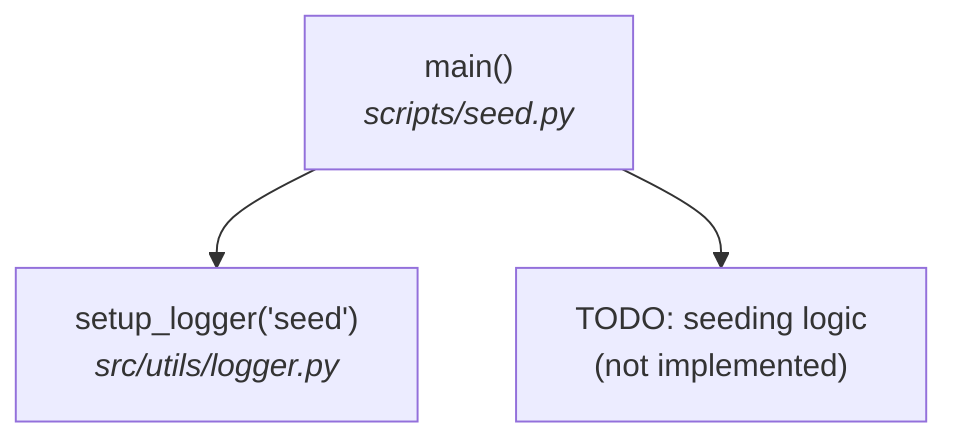

# seed.py — Execution Flow

## Overview

Documents the execution flow of `seed.py`, a placeholder script for seeding sample development data, and the pipeline-based alternative to use until it is implemented.

Seeds sample product data for development. Currently a placeholder — the seeding
logic is not implemented yet.

```bash
uv run python scripts/seed.py
```

## Flow diagram



## Step-by-step

| # | Step | Function | File |
|---|------|----------|------|
| 1 | Create the logger | `setup_logger()` | `src/utils/logger.py` |
| 2 | Log start/finish; seeding logic is a `TODO` | `main()` | `scripts/seed.py` |

## Current alternative

Until seeding is implemented, populate development data with the real pipeline:

```bash
uv run python scripts/crawl.py --all
uv run python scripts/ingest.py --source crawled
```

Or drop sample JSON/CSV files into `data/raw/products/` and run
`uv run python scripts/ingest.py --source products`.
